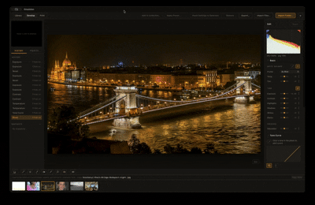

# Emulsion

*A local-first photo library & RAW editor — working title.*

[](https://github.com/AlfredWei/emulsion/actions/workflows/ci.yml)



Emulsion is a desktop app for photographers to import, organize, non-destructively edit, and export their photo libraries — including camera RAW — without a subscription or a cloud account. The catalog and the pixels stay on your own disk; there's no server component anywhere in the design.

**Status: M0–M4.5 complete, M5 (Performance, GPU, merges, faces) essentially done.** GPU-accelerated Develop rendering with CPU fallback, HDR merge, panorama merge, face detection/grouping, and a plugin/export-hook API v0 have all shipped; M5's "basic video handling" item was dropped from scope (2026-09-18, not a priority for this project). Three follow-on milestones — Map & geolocation, Develop effect quality/performance research, and an AI-editing roadmap spike — were added ahead of M6. See [PRD/MILESTONES.md](PRD/MILESTONES.md) for the full roadmap and [PROGRESS.md](PROGRESS.md) for exactly what's confirmed, what's in flight, and what's next — it's updated continuously, not just at milestone boundaries, so it's the authoritative source if this section ever drifts.

## Quick start

Prerequisites: [Rust](https://rustup.rs/) (1.77.2+; project developed against 1.97.1), [Node.js](https://nodejs.org/) (18+; developed against v23.5.0), and the platform's native build tools (Xcode Command Line Tools on macOS; [vcpkg](https://vcpkg.io/) + `vcpkg install libraw:x64-windows-static-md` on Windows — see [Tauri's prerequisites guide](https://tauri.app/start/prerequisites/) too, and [Platform support](#platform-support) below).

```bash
make install   # npm install
make dev       # start the app (Tauri window + Vite dev server)
```

`make help` lists everything else (`test`, `build`, `check`, `spike`, `clean`). See [Makefile](Makefile).

## Current state: what you'll actually see

Running `make dev` opens a real, dogfoodable app, not a scaffold. **Library**: grid/loupe/compare/survey views, flags/ratings/color labels, keywording, manual + smart collections, folder browsing, a multi-dimensional filter bar (rating/flag/label/camera/lens/date/text), and a People section for browsing/renaming detected faces — all backed by a real, persistent SQLite catalog with crash-safe writes and configurable backups. **Develop**: a full non-destructive edit stack (global tone, HSL, split toning, dehaze, tone curve, local adjustment brush/gradients/range masks, lens corrections, presets, soft proofing), GPU-rendered with automatic, tested CPU fallback when WebGPU isn't available. **Export**: JPEG/TIFF with an export-plugin hook for third-party post-processing. **Print**: layout templates + PDF/contact-sheet export. **Merges**: HDR bracket merge and panorama stitching, both hand-rolled (no external CV dependency). **Faces**: local, fully offline face detection/embedding/clustering (no cloud model calls) surfaced directly in Library.

- **The Rust core** (catalog, RAW decode, develop engine, every merge/faces/print pipeline) has a large real unit test suite: `make test`.
- **E2E tests** drive the actual Tauri window via WebdriverIO (`app/e2e/`) — golden-path, GPU-fallback, CPU/GPU parity, and performance specs among them.
- See [docs/PROJECT_STRUCTURE.md](docs/PROJECT_STRUCTURE.md) for what every file/folder in this repo is for, including the throwaway diagnostic routes (`m0-spike`, `m1-smoke`, `m1-slice2-smoke`) that predate the real app and aren't part of it.
- Looking for how to actually *use* the app once it's running? See [docs/USER_GUIDE.md](docs/USER_GUIDE.md).

## Documentation map

| Doc | What it's for |
|---|---|
| [PRD/PRD.md](PRD/PRD.md) | Product requirements: vision, scope, target user, functional/non-functional requirements. Start here for *what* this is. |
| [PRD/MILESTONES.md](PRD/MILESTONES.md) | The full roadmap (M0–M8, plus M4.5 and M5.5–M5.7 inserted as real needs surfaced), each with scope / explicitly-deferred / exit criteria. Start here for *what's next*. |
| [PRD/lightroom-reference.md](PRD/lightroom-reference.md) | Research on Lightroom's actual v1→now feature timeline, used to sequence the roadmap above. |
| [docs/rfc/](docs/rfc/) | Pre-implementation design docs for architecture/GPU-significant slices (M5's own practice) — RFC-0001 is the overall system architecture tying together the ADRs below; later RFCs (e.g. face detection, the plugin/export hook, map & geolocation) are per-feature, and RFC-0008/0009 plan the large-file refactor. |
| [docs/adr/](docs/adr/) | Individual architecture decisions (app shell, frontend stack, RAW decoding, rendering/color pipeline, catalog storage, edit representation, face detection's inference runtime, the plugin hook's process-invocation model), each with context, decision, consequences, and alternatives considered — several have dated "spike finding" or "shipped decision" sections where reality corrected or confirmed the original plan. |
| [docs/ux/UX-DESIGN.md](docs/ux/UX-DESIGN.md) | Design principles and module layouts for Library/Develop, plus reviewed static mockups at [docs/ux/mockups/](docs/ux/mockups/). |
| [docs/USER_GUIDE.md](docs/USER_GUIDE.md) | User-facing guide to the app's actual features — what each module does and how to use it, not how it's built. |
| [docs/PROJECT_STRUCTURE.md](docs/PROJECT_STRUCTURE.md) | What every file and folder in this repo is for. Start here for *where things live*. |
| [PROGRESS.md](PROGRESS.md) | Running log of what's actually done vs. in progress vs. blocked — the first thing to read after time away from this project. |

## Architecture, in short

- **Shell**: [Tauri](https://tauri.app/) — Rust core + the OS's own webview, not a bundled browser engine ([ADR-0001](docs/adr/ADR-0001-application-shell.md)).
- **Frontend**: Svelte(Kit), no generic component library ([ADR-0002](docs/adr/ADR-0002-frontend-ui-stack.md)).
- **RAW decoding**: [LibRaw](https://www.libraw.org/) via Rust FFI (`rsraw`) ([ADR-0003](docs/adr/ADR-0003-raw-decoding.md)).
- **Rendering**: "decode once in Rust, edit reactively via in-webview WebGPU" — confirmed working on macOS by an M0 spike, not just assumed ([ADR-0004](docs/adr/ADR-0004-rendering-and-color-management.md)).
- **Catalog**: embedded SQLite via `rusqlite`, XMP as export-only interchange, never the source of truth ([ADR-0005](docs/adr/ADR-0005-catalog-storage.md)).
- **Edits**: a versioned, JSON-serializable, fully non-destructive edit stack ([ADR-0006](docs/adr/ADR-0006-edit-representation.md)).
- **Face detection**: `tract` (pure-Rust ONNX inference) running YuNet (detection) + SFace (embedding), fetched-once-and-cached rather than committed, fully local/offline ([ADR-0007](docs/adr/ADR-0007-face-detection-and-recognition.md)).
- **Extensibility**: a fire-and-forget, no-shell, no-sandbox export-plugin hook — v0 of the plugin API, intentionally minimal ([ADR-0008](docs/adr/ADR-0008-plugin-extensibility-api-v0.md)).

Permanently out of scope: cloud sync, mobile companion app, any video support at all. See [PRD.md §3](PRD/PRD.md#3-non-goals-permanent-not-just-later) — note M5.5's Map milestone carries one narrow, explicitly-documented exception (a user-initiated address search calls an external geocoding API; catalog/photo data never leaves the device).

## Platform support

Developed on macOS; Windows is validated via CI on GitHub's own Windows runners (see [.github/workflows/ci.yml](.github/workflows/ci.yml)), not a local machine — this project doesn't have one. The Rust core builds and its full test suite passes on both `macos-latest` and `windows-latest`, and CI also runs the real WebdriverIO E2E suite against the built Tauri app on both platforms. RAW decoding (`rsraw`) links a vcpkg-installed prebuilt LibRaw on Windows instead of building from source under MSVC — see [ADR-0003](docs/adr/ADR-0003-raw-decoding.md) for why and [app/src-tauri/vendor/rsraw-sys/PATCH.md](app/src-tauri/vendor/rsraw-sys/PATCH.md) for exactly what was patched.

See [PROGRESS.md](PROGRESS.md) for the current, precise status of any platform-specific gap — this section intentionally doesn't restate exact figures that go stale between edits.

## Working practices

- `main` is the stable branch. Non-trivial work happens on a `feature/*` or `docs/*` branch, gets pushed, and opens a PR — then **stops for review**. Only after explicit approval does it get merged (merge-commit style, not squash/rebase) and `main` gets pulled before starting the next branch. See the commit history for the pattern (M0/M1 Slice 1's earliest history predates this and was merged directly).
- [PROGRESS.md](PROGRESS.md) gets updated as work lands, not just at the end of a milestone — read it first when picking this project back up.
- No cloud, no telemetry, no external dependencies beyond what's declared in `app/package.json` / `app/src-tauri/Cargo.toml`.

## License

[MIT](LICENSE)
