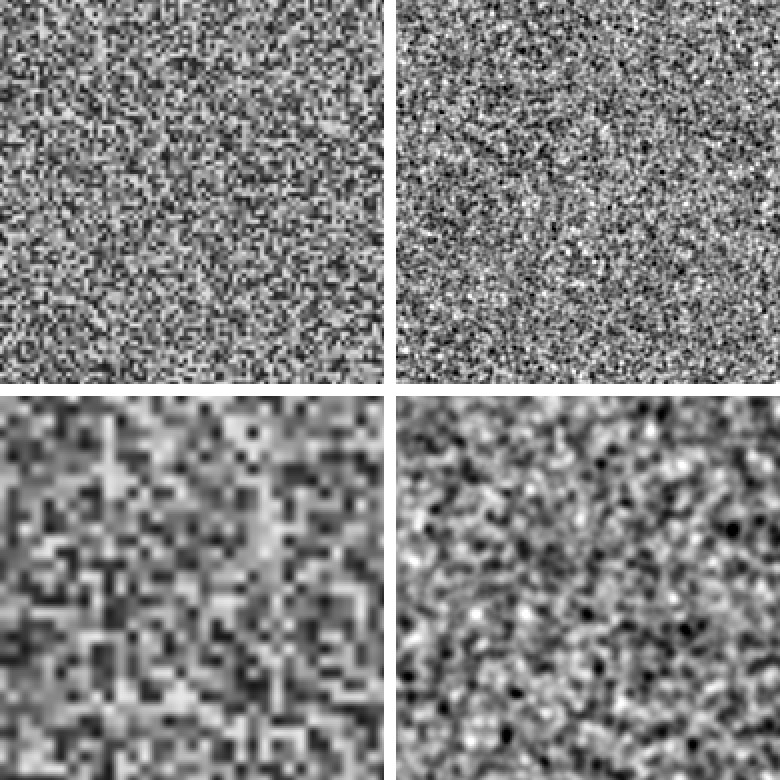

# RFC-0020: Grain — integer hash + stationary particle noise (M5.6's tenth effect)

- Status: Draft v2 — for review in PR (flips to Accepted once merged)
- Date: 2026-09-30
- Companion documents: [PRD/MILESTONES §M5.6](../../PRD/MILESTONES.md#m56--develop-effects-quality--performance-research) and [§M5.8](../../PRD/MILESTONES.md#m58--negative-film-simulation-grain-stocks) (the follow-on this RFC's generator is designed to serve), [develop_engine/effects.rs](../../app/src-tauri/src/develop_engine/effects.rs), [gpu/shaders/gradeUniforms.js](../../app/src/lib/gpu/shaders/gradeUniforms.js), [e2e/specs/develop-cpu-gpu-parity.e2e.js](../../app/e2e/specs/develop-cpu-gpu-parity.e2e.js), [PROGRESS.md](../../PROGRESS.md)

## 0. Process note

Self-chosen "next" pick from the "not yet researched effects" list. Tone Curve was read first and set aside: it is a Fritsch–Carlson monotone cubic with a shared 256-entry LUT on both sides, with nothing to fix.

**v1 of this RFC** found that the CPU and GPU grain fields are uncorrelated (a `sin`-based hash whose error is multiplied by ~44,000) and proposed an integer hash. **Review feedback on v1**: the grain "easily results in a repeated pattern." That was investigated rather than assumed, and it is real and has **two independent causes**, only one of which the integer hash fixes (§1.2, §1.3). v2 therefore keeps the integer hash and **replaces the bilinear value-noise generator with a stationary sparse-convolution "particle" noise** (§3). v2 also generalises the design so the follow-on milestone, M5.8 (Negative film simulation), can reuse the generator (§4.4).

## 1. Problem

### 1.1 CPU and GPU draw different grain (unchanged from v1)

Both `effects.rs` (`grain_hash`) and `gradeUniforms.js` (`grainHash`) compute the per-lattice-cell random value as `fract(sin(dot(p, (12.9898, 78.233))) * 43758.5453123)`. Their doc comments call this acceptable within the ±2/255 parity bar. That is wrong, because the `* 43758.5453123` multiplies whatever error `sin` has by ~44,000 before `fract` discards the integer part.

**Measured on this machine's WebGPU adapter (Apple, Metal 3)**, evaluating the exact WGSL expression on random integer lattice coordinates against an f32-accurate CPU reference:

| Max coordinate | GPU `sin()` abs. error, median / p99 | Implied hash error at p99 (`error × 43758`) | Median CPU↔GPU hash difference |
|---|---|---|---|
| ≤ 2 | 1.8×10⁻⁶ / 5.2×10⁻⁶ | 0.23 | 0.08 (only 4 distinct coordinates) |
| ≤ 16 | 1.2×10⁻⁵ / 8.1×10⁻⁵ | 3.5 | **0.23** |
| ≤ 256 | 1.9×10⁻⁴ / 1.3×10⁻³ | 58 | **0.25** |
| ≤ 4096 | 3.0×10⁻³ / 2.1×10⁻² | 917 | **0.25** |

(Reproduced by [Appendix A](#appendix-a-how-the-findings-were-verified) — probe re-runs land within the second digit of these values; the sin-error columns vary a little run to run because the coordinates are random windows.)

A median difference of 0.25 is what two independent uniform random numbers give, so from ~16 px onward the two fields are effectively uncorrelated. The hash argument also reaches ~3×10⁵ at 4096 px where an f32 spacing is ~0.03 rad, and CPU (mul then add) vs GPU (fused multiply-add) round it differently (measured max argument difference 0.031). WGSL only promises `sin` absolute error 2⁻¹¹ on `[-π, π]`, so the result also varies between GPUs/drivers/OSes.

Consequences: **preview ≠ export** (the GPU preview and the CPU export/thumbnail/fallback paths draw different patterns, differing by ~±10/255 per pixel at Amount 100); **not reproducible across machines**; and **the parity net cannot see it** (`develop-cpu-gpu-parity.e2e.js` has no Grain scenario).

### 1.2 The repeated pattern, cause A: the GPU `sin` hash has real structure (measured)

The review's "repeated pattern" is visible on the GPU. The same low-precision `sin` that decorrelates the GPU from the CPU also makes the GPU's own field non-random. Measured by rendering the app's actual WGSL `grainDelta` (Amount 100, Roughness 50) to a 256×256 texture on this machine's GPU and computing the max 2-D autocorrelation at lags ≥ 12 px, compared with the accurate-`sin` CPU field at the *same lag*:

| Size | Cell (px) | GPU max autocorrelation @ lag (dx,dy) | CPU (accurate `sin`) at that same lag |
|---|---|---|---|
| 0 | 1.0 | **0.578** @ (2, 13) | 0.054 |
| 25 (default) | 2.25 | **0.367** @ (4, 29) | 0.036 |
| 50 | 3.5 | **0.283** @ (7, 46) | 0.012 |

An autocorrelation of 0.3–0.6 at a lag of a dozen-plus pixels means the pattern reproduces itself at a fixed offset — literally a repeat. Independent uniform noise sits at ≈ ±0.02–0.05 for a field this size. The strongest repeat is at the *default* Size and the finest sizes. The **integer hash removes this cause** (it has no floating-point transcendental to leave structure in): measured lag-1 correlation between neighbouring lattice values over a 512² lattice is `−0.001`, mean 0.5006, std 0.2885 (ideal 0.5 / 0.2887).

### 1.3 The repeated pattern, cause B: value noise has a lattice signature even with a perfect hash

Fixing the hash is necessary but not sufficient. Grain is currently **bilinear-smoothstep value noise on a square lattice**: each pixel blends the four surrounding lattice values. Where a pixel sits exactly on a lattice point its value is one hash sample (full variance); half-way between points it is a blend of four (variance reduced, since the smoothstep weights are ≤ 1 and sum to 1). The grain's *contrast therefore pulses with the lattice period*, forming a faint regular grid that the eye picks up as a repeat — even for a perfectly random hash.

Measured with an **integer hash** (so cause A is excluded): the per-pixel variance across 800 independent seeds, on a 64×64 patch at cell 6 px, summarised as relative standard deviation of the smoothed variance map (lower = more stationary; a truly stationary field of the same correlation length gives **0.041–0.046**, measured with Gaussian-filtered iid noise at σ = 1.5–2.5 px):

| Generator (integer hash, unit-variance normalised) | Variance-map rel. std | Max/min variance across a cell |
|---|---|---|
| **Stationary reference (Gaussian-filtered iid noise)** | 0.041–0.046 | 1.30–1.36 |
| Bilinear value noise (**today's structure**) | **0.221** | **2.85 : 1** |
| Perlin gradient noise | 0.250 | 4.07 : 1 |
| Perlin, 2 octaves, rotated | 0.194 | 2.78 : 1 |
| Sparse-convolution, K = 2 particles/cell | 0.046 | 1.33 : 1 |
| Sparse-convolution, K = 3 | 0.047 | 1.35 : 1 |
| Sparse-convolution, K = 4 | 0.046 | 1.33 : 1 |
| **Grain v2 (§3), ρ = 0 / 0.5 / 1** | 0.042 / 0.044 / 0.051 | 1.27 / 1.30 / 1.36 |

(An earlier, coarser run with fewer seeds gave 0.342 for value noise and 7.9 : 1 for Perlin; the 800-seed run above is the trusted one. The conclusion is the same: value and Perlin noise have a 3–4× variance swing across each lattice cell, while sparse convolution is indistinguishable from a stationary field.) Simply swapping bilinear value noise for Perlin (the usual "just use a better noise" answer) makes the signature *worse*, not better. Rotated multi-octave Perlin only partly hides it. A stationary construction is needed.

What did **not** distinguish the algorithms, stated so the metrics are not oversold: with an integer hash, *none* of them shows a large global autocorrelation peak or spectral spike in a 256² field (all ≈ 0.02–0.10, indistinguishable from ideal iid noise given only ~42 cells across at Size 100). The lattice signature in the table above is the differentiator, not autocorrelation.

## 2. Non-goals

- **`GRAIN_MAX_CELL_PX`, the Size→cell mapping (1 px at Size 0 → 6 px at Size 100), and Amount semantics** stay. Amount is a linear scale of the same additive luminance delta, calibrated so that the *standard deviation* at Amount 100 with default Size/Roughness matches today's measured `0.0511` (§3.3) — Amount does not silently get stronger or weaker.
- **Resolution scaling is unchanged**: `size` stays a fixed absolute pixel scale (the "named limitation" Dehaze/Texture/Clarity already accept), so preview and full-resolution export still differ in *scale*; this RFC makes the pattern *at a given pixel grid* identical. (Resolution-relative grain is an M5.8 item.)
- **Tone-dependent amplitude and black/white clipping**: a uniform additive delta is one-sidedly clipped at 0/1, lifting pure blacks and darkening pure whites; real grain is also weaker at the tonal extremes. Deferred to M5.8, which needs a tonal-response control anyway.
- **Per-channel (chromatic) grain**: the "additive luminance delta added equally to all three channels" shape stays. Colour vs mono grain is an M5.8 item; §4.4 keeps the door open.
- **Grain remains unseeded per image** — same pattern for every image, as today. (The new generator takes a `seed` parameter, used by tests and by M5.8's per-channel layers, but the app passes a constant.)
- **No claim of matching any specific film stock or Adobe's grain.** That is M5.8's own research task.

## 3. Research finding and design

### 3.1 Integer hash (kept from v1, extended with a seed)

An integer avalanche hash on `u32` is defined bit-for-bit identically by Rust (`wrapping_mul`) and WGSL (`u32` arithmetic wraps):

```
lowbias32(x):            // Chris Wellons' well-tested 32-bit avalanche (Hash Prospector)
  x ^= x >> 16;  x *= 0x7feb352d
  x ^= x >> 15;  x *= 0x846ca68b
  x ^= x >> 16

particle_hash(ix, iy, s) = lowbias32( u32(ix) ^ lowbias32( u32(iy) ^ 0x9E3779B9 ^ s ) )
```

For `s = 0`, `particle_hash(ix, iy, 0) >> 8` divided by 2²⁴ is exactly v1's `grain_hash`, so v1's golden vectors are kept:

| `(ix, iy)` | `particle_hash(…, 0)` | `>> 8 / 2²⁴` |
|---|---|---|
| (0, 0) | `0xae6f80f1` | 0.6813888549804688 |
| (1, 0) | `0xa07c7a97` | 0.6268993616104126 |
| (0, 1) | `0x8e374fe0` | 0.5555314421653748 |
| (1, 1) | `0xa290702b` | 0.6350164413452148 |
| (17, 42) | `0xf50c661e` | 0.9572204351425171 |
| (4095, 3071) | `0x30ed22ee` | 0.19111835956573486 |
| (123456, 654321) | `0x4cdf1783` | 0.30027908086776733 |

The result is an exact integer, so CPU and GPU agree **bit-for-bit** before any float is involved.

### 3.2 Sparse-convolution particle noise (new)

Instead of interpolating values *between* lattice points, scatter random "grains" (particles) and sum their compact-support kernels — Lewis's sparse-convolution noise (SIGGRAPH 1989), the same family as the Boolean-model grain simulators used for film-grain synthesis (e.g. Newson, Delon & Galerne, 2017). Every point in the image sees the same *statistics* regardless of where it sits relative to the lattice, so there is no lattice signature (§1.3), and — unlike interpolated value noise — this is also the physically appropriate model: film grain *is* a random scatter of discrete silver-halide/dye clouds.

For a point `p` in **cell units** (`p = pixel / cell`), with `ci = floor(p)`:

```
grain_particle_noise(p, ρ, seed) -> f32          // ρ = roughness ∈ [0,1]
  sum = 0
  for (a, b) in {-1,0,1}²:                        // 3×3 neighbourhood
    for k in 0..K:                                // K = 2 particles per cell
      h = particle_hash(ci.x + a, ci.y + b, seed + k * 7919)
      jx = (h & 0xFF) / 256                       // jitter inside the cell
      jy = ((h >> 8) & 0xFF) / 256
      wbits = (h >> 16) & 0xFF
      sign = (wbits & 0x80) ? +1 : -1
      um = (wbits & 0x7F) / 128
      ur = ((h >> 24) & 0xFF) / 256
      w = sign * (1 - ρ * um)                     // magnitude in (1-ρ, 1]
      r = 1 - 0.5 * ρ * ur                        // radius in (1-ρ/2, 1] cells
      d2 = ((p.x - (ci.x + a + jx))² + (p.y - (ci.y + b + jy))²) / r²
      if d2 < 1:  sum += w * (1 - d2)²            // smooth, C¹ compact kernel
  return sum * N(ρ)
```

**Why it works.** The kernel `(1−d²)²` has support radius ≤ 1 cell and each particle lies inside its cell, so any particle that can reach `p` lives in the 3×3 block around `ci` — the sum is *exact*, not a truncation. It also makes the algorithm **robust to a floor() mismatch**: if CPU's and GPU's `p` differ by an ulp at an exact cell boundary and `ci` comes out one different, the block that is missed contains only particles at distance ≥ 1, whose kernel is exactly 0 there. The result is continuous, so an ulp of disagreement causes an ulp-order difference, not a different pattern. (Bilinear value noise has the same benign property; the sin hash did not.)

**Unit variance by construction, not by tuning.** Signs are ±1 with equal probability, so the field has mean 0. Its variance is `K · E[w²] · E[∫ kernel²]` for a homogeneous Poisson-like scatter of density `K` per cell²:

```
E[w²]      = 1 − ρ + ρ²/3
∫(1−d²)⁴ over the unit disk = π/5  →  E over radius = 0.2π · (1 − a + a²/3)   with a = ρ/2
N(ρ)       = 1 / sqrt( K · (1 − ρ + ρ²/3) · 0.2π · (1 − a + a²/3) )
```

Values: `N(0) = 0.8921`, `N(0.5) = 1.3303`, `N(1) = 2.0230` (K = 2). Verified numerically over 800 seeds: field std 0.997–1.04 for ρ ∈ {0, 0.5, 1}. **This is what removes the old amplitude coupling** (v1 named it and left it: Roughness 0 had std 0.2195 vs 0.2887 at Roughness 100, i.e. sliding Roughness up also made the grain 24% stronger). In v2 Roughness changes the *character* only, never the strength.

**Measured properties** (§1.3, and a numpy reference over a 256² field): stationarity at the reference floor (table above); isotropy — axis/diagonal spectral energy 0.98–1.12 (1.0 = perfectly isotropic; value noise measured similarly here but its lattice pulses in variance instead); no spectral spike (0 bins > 30× local mean). A rendered side-by-side (Appendix A.5) shows value noise with a visible square-lattice texture and v2 as organic, clumpy grain.

**Why K = 2.** K = 2, 3, 4 measured the same stationarity (0.046 / 0.047 / 0.046). Cost is proportional to `9K` hashes per pixel, so the smallest K that is already at the floor is chosen. (K = 1 was not measured and is *not* assumed acceptable; §6 requires a re-measurement if the performance budget forces it.)

### 3.3 Mapping Amount / Size / Roughness

- **Size** → cell size exactly as today: `cell = 1 + (size/100)·(GRAIN_MAX_CELL_PX − 1)`, `p = pixel / cell`.
- **Roughness** → `ρ = roughness/100`. ρ = 0: every particle identical in size and strength (even, fine-textured grain). ρ = 1: strengths span (0, 1] and radii (0.5, 1], so a few large clumps stand out from many faint specks (contrasty, "clumpy" grain). **The old blocky raw-cell mode is removed**: at Roughness 100 the old field was per-cell constant squares — the most grid-like output of the effect and a visible cause of "repeated pattern" complaints.
- **Amount** → `delta = noise · (amount/100) · GRAIN_SIGMA`, with **`GRAIN_SIGMA = 0.05`** replacing `GRAIN_STRENGTH = 0.12`. The old constant was a *peak* (±0.12); the new one is a *standard deviation*. The calibration target is measured, not guessed: the old field at Amount 100, default Size 25 / Roughness 50, has delta std **0.0511** (Roughness 0: 0.0516, Roughness 100: 0.0694 — the coupling again). The new field is ≈ Gaussian, so a std of 0.05 puts ±3σ at ±0.15 — a slightly heavier tail than the old ±0.12 cap, which is what real grain does, and is not clipped.

### 3.4 A real, named consequence

- **The pattern realisation changes** (any different generator does). Grain is procedural and unseeded, so no saved edit depends on a particular pattern.
- **Roughness's *meaning* changes** from "smooth ↔ blocky" to "even ↔ clumpy", and its amplitude no longer moves with it. Existing catalog edits with a non-default Roughness keep the same numeric value but re-render with a different character and (at high Roughness) lower strength than before. Pre-release, local-only catalog; no migration is attempted — there is no faithful mapping from "blocky" to any particle-noise setting.
- **Amount and Size stay approximately what they were** (std matched at defaults; cell size unchanged), but the visible strength of a given Amount is not guaranteed pixel-equal to before.

## 4. Design

### 4.1 CPU (Rust) — `effects.rs`

- `lowbias32(u32) -> u32` (private, `wrapping_mul`), `particle_hash(ix: i32, iy: i32, s: u32) -> u32`.
- `pub(super) fn grain_particle_noise(p: (f32, f32), roughness01: f32, seed: u32) -> f32`: the §3.2 loop, `N(ρ)` computed in closed form (a handful of f32 ops, hoisted out of the loops).
- `grain_delta(coord, &Grain)` keeps its signature (`pipeline.rs` is untouched): returns `0.0` at `amount == 0` (exact passthrough), else `grain_particle_noise(coord / cell, ρ, GRAIN_SEED) * (amount/100) * GRAIN_SIGMA`, `GRAIN_SEED = 0`.
- Removed: the `sin` hash, `grain_value_noise`, the smooth↔raw blend, `GRAIN_STRENGTH`. Doc comments rewritten (they currently argue that a non-bit-exact hash is acceptable).
- `grain_particle_noise` takes a *seed* and returns *unit-variance noise* so M5.8 can call it once per channel or dye layer with different seeds and per-stock parameters, without changing this generator.

### 4.2 GPU (WGSL) — `gradeUniforms.js`

`lowbias32`, `particleHash(ix: i32, iy: i32, s: u32) -> u32`, and `grainParticleNoise(p: vec2<f32>, rho: f32, seed: u32) -> f32` in the same structure; `grainDelta(coord)` keeps its signature, so the call in `premask.js` is unchanged. No new uniform, binding, pass, or bind group. `struct Grain { amount, size, roughness }` unchanged.

### 4.3 Cost

`9 · K = 18` hashes per pixel (each ≈ 12 integer ops) + 18 distance/kernel evaluations, versus 5 hashes today. Trivial on the GPU. On the CPU this only runs when Amount ≠ 0 and the CPU path is the export / thumbnail / fallback route; nonetheless M5.6's exit criteria require **an explicit performance check against M5's ~100 ms interactive budget before it ships**: measure the CPU pipeline with Grain on at the largest tested image size and record it in PROGRESS.md. If it exceeds budget, the documented fallbacks are (a) a skip-early test on the nearest-particle bounding distance, (b) K = 1 **after re-measuring stationarity** (§3.2 said K = 1 was not measured), never a silent quality downgrade.

### 4.4 Reuse by M5.8 (negative film simulation)

The one new abstraction is a pure function of `(cell-space position, roughness, seed)` returning unit-variance noise. M5.8 layers on top of it: a per-stock parameter set (size, roughness, tonal response, colour-vs-mono) and per-channel/per-dye-layer calls with distinct seeds. Nothing in this RFC pre-commits M5.8's design beyond that seam.

## 5. Testability

- **Golden vectors on both sides.** The §3.1 hash table asserted **exactly** in a Rust unit test, and executed on a real GPU in the browser against the actual `particleHash` WGSL — equal, not "within tolerance". Plus **golden full-function vectors** for `grain_particle_noise`, computed independently in a numpy reference (not by the code under test), asserted in Rust to `1e-4` and reproduced on the real GPU:

  | `p` (cell units) | ρ = 0 | ρ = 0.5 | ρ = 1 |
  |---|---|---|---|
  | (0, 0) | −0.154646 | −0.257437 | −0.167784 |
  | (3.25, 7.75) | 0.932119 | 0.772472 | 0.286400 |
  | (100.5, 200.125) | −0.581099 | −1.018404 | −1.398528 |
  | (1234.5, 2345.5) | 1.521419 | 1.568755 | 1.504852 |

  (seed 0, K = 2. Tolerance `1e-4` on a unit-variance value is ≪ 1/255 after the `× 0.05` scale. The numpy reference is computed in `float32` and is not itself bit-exact with either engine — hence a tolerance.)
- **Amplitude is decoupled from Roughness (the fix for v1's named item):** over a large patch and many seeds, std ∈ `1 ± 0.05` and |mean| < 0.05 at ρ = 0, 0.5, 1 and at cell sizes 1, 3.5, 6. The delta std at Amount 100, Size 25, Roughness 50 must come out within 5% of `0.0511`.
- **Stationarity (the lattice-signature fix):** variance-map relative std over ≥ 400 seeds on a fixed patch is ≤ 0.06 (measured 0.042–0.051; value noise 0.221; the test would fail loudly on a value-noise implementation). Test-only `seed` parameter is what makes this possible.
- **Isotropy:** horizontal vs diagonal autocorrelation at equal Euclidean lag agree within 0.05.
- **Repeat check on the real GPU (the direct test of the review's complaint):** render the actual WGSL at Size 0 / 25 / 50 (256×256, Amount 100) and compute max |autocorrelation| at lags ≥ 12 px. Today's field measures **0.58 / 0.37 / 0.28**; the new field must be ≤ 0.15, i.e. in the range of ideal iid noise. **Stated limitation:** a CPU-side version of this test cannot discriminate old from new (accurate `sin` is also clean, §1.2), so this check must be run on the GPU and its numbers recorded in PROGRESS.md.
- **Existing behaviour preserved:** `amount == 0` exact passthrough; `grain_delta` deterministic for a repeated coordinate; Size still scales feature size; Roughness 0 and 100 still differ. Tests that asserted properties of the old generator (`grain_hash_at_origin_is_exactly_zero`, the blocky-cell grouping test) are replaced, with a comment saying why, rather than deleted silently.
- **End-to-end CPU↔GPU parity — the test that never existed:** a new `develop-cpu-gpu-parity.e2e.js` scenario (Grain Amount 60, Size 25, Roughness 50, on the existing flat `ROAD_PATCH`), asserting agreement within the file's standard tolerance. Before this work such a scenario would fail by roughly the grain amplitude.
- **Performance check** per §4.3.

## 6. Exit criteria (this slice)

- Integer hash + particle noise implemented in Rust and WGSL; hash golden vectors reproduced **exactly** on a real GPU; full-function golden vectors within `1e-4` on both.
- Amplitude, stationarity and isotropy tests pass; the real-GPU repeat check at Size 0/25/50 is ≤ 0.15 with the measured numbers recorded next to today's 0.58/0.37/0.28.
- New Grain CPU/GPU parity e2e scenario added and run by CI.
- CPU performance with Grain on is measured and recorded against the ~100 ms budget; any fallback taken (§4.3) is named, with its own re-measurement.
- PROGRESS.md records: the §1.1 and §1.2 measurement tables, the §1.3 stationarity table, the corrected doc comments, the §3.4 consequence (changed realisation, Roughness meaning), and the items handed to M5.8 (tonal response / black-white behaviour, per-channel grain, resolution-relative size).
- No user-facing copy describes Roughness as "blocky" (checked: only the two source files' comments, `PROGRESS.md`, and the old grain tests mention it); those comments/tests are rewritten with the generator.

## Appendix A: how the findings were verified

Everything this RFC calls "measured" can be re-run from two files in [`RFC-0020-appendix/`](RFC-0020-appendix/). The split is deliberate: **the GPU numbers can only come from a real GPU**, everything else is a numpy reference that is independent of the Rust/WGSL code under test (which is also what lets it produce golden values). Where the app's own code is measured, it is measured *unmodified*.

| Claim in this RFC | Method | Reproduce with |
|---|---|---|
| §1.1 GPU `sin` error, CPU↔GPU hash disagreement | Real WebGPU adapter, the app's own WGSL | `gpu_probe.js` |
| §1.2 the repeat (autocorrelation at lags ≥ 12 px) on the GPU | Real WebGPU adapter, the app's own `grainDelta` | `gpu_probe.js` |
| §1.2 the same lag on the CPU (accurate `sin`) | numpy reference of today's algorithm | `grainlab.py cpu` |
| §1.3 stationarity of value / Perlin / sparse-convolution / v2 | numpy, 800 seeds | `grainlab.py station` |
| §3.1 hash golden vectors and uniformity | numpy, independent implementation | `grainlab.py hash` |
| §3.2–3.3 normalisation, calibration, golden noise vectors | numpy | `grainlab.py golden delta` |
| §3.2 no spectral spike, isotropy | numpy | `grainlab.py metrics` |

### A.1 Setup

```bash
# numpy side (Pillow only for the montage)
cd docs/rfc/RFC-0020-appendix
python3 -m venv venv && ./venv/bin/pip install numpy scipy pillow
./venv/bin/python grainlab.py                 # every table (stationarity takes a couple of minutes)
./venv/bin/python grainlab.py hash golden     # or pick sections
```

For the GPU side, start the dev server (`npm --prefix app run dev`), open `http://localhost:1420` in any browser with WebGPU (the Claude desktop Browser pane and current Chrome both work), paste `gpu_probe.js` into the devtools console. It prints one JSON object with the adapter name and all numbers. It does not touch app state: it imports the app's own shader string (`gradeUniforms.js`), **slices out `struct Grain … fn grainDelta` verbatim by brace-matching**, and runs it in a private compute pipeline. Because it slices whatever is in that file *now*, re-running it after this RFC is implemented measures the **new** WGSL with no edits — that is how the exit-criteria "≤ 0.15" check is run.

### A.2 Why the GPU/CPU hash disagrees (§1.1) — and how it was isolated

Two suspects: GPU `sin()` precision, and the *argument* `x*12.9898 + y*78.233` rounding differently (FMA vs separate multiply-add). The probe separates them:

1. **`sin` alone.** Compute the exact float32 argument on the CPU, upload the array, evaluate bare `sin(arg)` on the GPU, and compare to `Math.sin(arg)` (double precision). That is the "GPU `sin()` abs. error" column — no hash involved.
2. **Multiply by 43758.5453123.** The "implied hash error" column is just that error × 43758, i.e. what `fract` sees. Not measured, *derived*, so it is labelled as such.
3. **The whole hash.** Evaluate the app's actual `grainHash` on integer lattice coordinates, compare to an f32-emulating CPU version (`Math.fround` at every step, `Math.sin` for the transcendental — a stand-in for Rust's accurate `f32::sin`), and take the **wrapped** difference on [0, 1) (so 0.99 vs 0.01 counts as 0.02). Two independent uniform random numbers have a mean wrapped difference of **0.25** exactly; a median of 0.25 therefore reads as "no correlation at all", not as "0.25 off".
4. **Argument rounding.** The CPU argument was compared to a fused-multiply-add argument for the same coordinates (max difference 0.031 at ≤ 4096). This step was done in an ad hoc script during the investigation and is not part of `gpu_probe.js`; the hash-vs-coordinate rows already contain its effect.

Rows are labelled by *maximum coordinate* (window of lattice coordinates all below that value; for the ≤ 2 row there are only four distinct coordinates, hence its noisier 0.08 median).

### A.3 Confirming the "repeated pattern" complaint is real (§1.2)

The review said grain "easily results in a repeated pattern". Rather than assume a cause, the measurement is the one that fits the description: does the field correlate with a *shifted copy of itself*?

- Render the app's `grainDelta` on a 256×256 grid at Amount 100 / Roughness 50 (Size 0, 25, 50).
- For every integer lag `(dx, dy)` with `|(dx,dy)| ≥ 12 px` and `|dx|,|dy| ≤ 60`, compute the normalised autocorrelation (mean-subtracted, divided by variance, averaged over the actual overlap only — no circular wrap that would inflate edge lags). Report the largest magnitude and where it is.
- Lags under 12 px are excluded because a grain field is *supposed* to be correlated within one cell.
- **Yardstick.** Independent noise gives ≈ ±0.02–0.05 at this size (measured for iid Gaussian noise in `grainlab.py metrics`: 0.017). Anything ≥ 0.2 is a real repeat.
- **Control.** The same lag evaluated on the CPU algorithm with accurate `sin` (`grainlab.py cpu`) gives 0.054 / 0.036 / 0.012, so the repeat is *not* in the algorithm on paper: it is what the GPU's low-precision `sin` does to it. This is also why the repeat was not seen in any CPU-based check, and why the RFC's repeat test must run on a GPU (§5).
- The strongest repeats sit at *small* lags in small-Size grain, e.g. (2, 13) px — a near-vertical stripe that recurs every ~13 rows — which is what "easily results in a repeated pattern" looks like on screen.

### A.4 Separating the two causes (§1.3)

The integer hash removes cause A (GPU `sin` structure). To find out whether that is *enough*, cause B — structure inherent to the algorithm — was tested with the hash held constant at the integer hash for every generator, so the hash is not a variable:

- **Stationarity test.** A field with no lattice structure has the same variance at every pixel. Generate the same generator under **800 independent seeds**, compute the variance *across seeds* at each pixel of a 64×64 patch (cell 6 px), lightly smooth it (3×3) to reduce sampling noise, and report `std/mean` and `max/min` of that variance map. Value noise lands at 0.221 (a 2.85 : 1 swing across each lattice cell) — that is the periodic pulse in contrast that the eye reads as a grid.
- **Baseline.** How low can this number go for a *perfectly* stationary field with the same correlation length? Gaussian-filtered iid noise (σ = 1.5, 2.0, 2.5 px) gives **0.041–0.046**. The floor is not zero because the 3×3 smoothing averages only a few *independent* samples of a correlated field. An earlier run with 48 seeds, and no baseline, said 0.342 / "noise floor 0.050" — it was too noisy to compare, which is why it was redone at 800 seeds *with* a same-correlation baseline before anything was written down.
- **Candidates**: bilinear value noise (today), Perlin, two-octave rotated Perlin, plain sparse-convolution at K = 2/3/4 particles/cell, and grain v2. Perlin and rotated Perlin were included because "use Perlin instead" is the obvious fix; it is measurably *worse* (4.07 : 1).
- **What did not discriminate.** Autocorrelation and spectral spikes, run on all candidates with the integer hash (`grainlab.py metrics`), show nothing wrong with any of them at this field size (all ≈ 0.02–0.10; that is sampling noise given ~42 cells across). The RFC says so in §1.3 rather than hiding the metrics that did not favour the conclusion.

### A.5 Seeing it

`grainlab.py montage` writes `montage.png`: today's structure (integer hash, so the hash is *not* what you are looking at) on the left, grain v2 (ρ = 0.5) on the right; top row cell 2.25 px (the default Size), bottom row cell 6 px. Same standard deviation and same contrast stretch in both. The left column shows a visible square-lattice texture; the right column does not.



### A.6 Checking the new generator against its own claims

- **Golden vectors** (§3.1, §5) come from `grainlab.py hash` / `golden`, an implementation independent of Rust and WGSL, so a bug copied into both engines cannot make them agree by accident.
- **Unit variance** is derived analytically (`N(ρ)`, §3.2) and then *checked* rather than trusted: `grainlab.py golden` prints std 0.996 / 1.001 / 1.005 (ρ = 0 / 0.5 / 1) over 200 seeds × 64×64.
- **Amplitude calibration** (§3.3): `grainlab.py delta` prints the old field's delta std at Amount 100 (0.0514 / 0.0509 / 0.0692 for Roughness 0 / 50 / 100 with the integer hash; the GPU probe's own reading at defaults is 0.0506). That is the source of `GRAIN_SIGMA = 0.05` and of the "Roughness also changes amplitude" observation.

### A.7 Limits of this verification (stated plainly)

- **One GPU.** All GPU numbers are Apple / Metal 3. Other vendors' `sin` will differ (that is the point of §1.1), so the *size* of the old repeat will differ; the claim "the integer hash is bit-identical everywhere" rests on the WGSL/Rust integer semantics, and is verified only on this adapter until the golden vectors are run on the Windows CI GPU/software adapter as well.
- **The CPU "reference" for `sin`** is `Math.sin` on float32-rounded values (numpy `float32` `sin` in `grainlab.py`), a proxy for Rust's `f32::sin` — not Rust itself. Rust-side numbers will be recorded by the implementation PR's tests.
- **Metrics are proxies.** Autocorrelation and the variance map detect the two failure modes found; they are not a claim that no other visual artefact exists. Visual review of the implementation on real photos is an exit criterion in §6's spirit, not something these scripts replace.
- **Numbers in this RFC's tables came from several runs** (random coordinate windows, fixed seeds where stated). Re-runs agree to about the second digit; the tables were reconciled to the checked-in scripts before this version was committed, and where an earlier draft's number differed (e.g. Size 25 repeat 0.40 → 0.367) the reproducible one replaced it.
