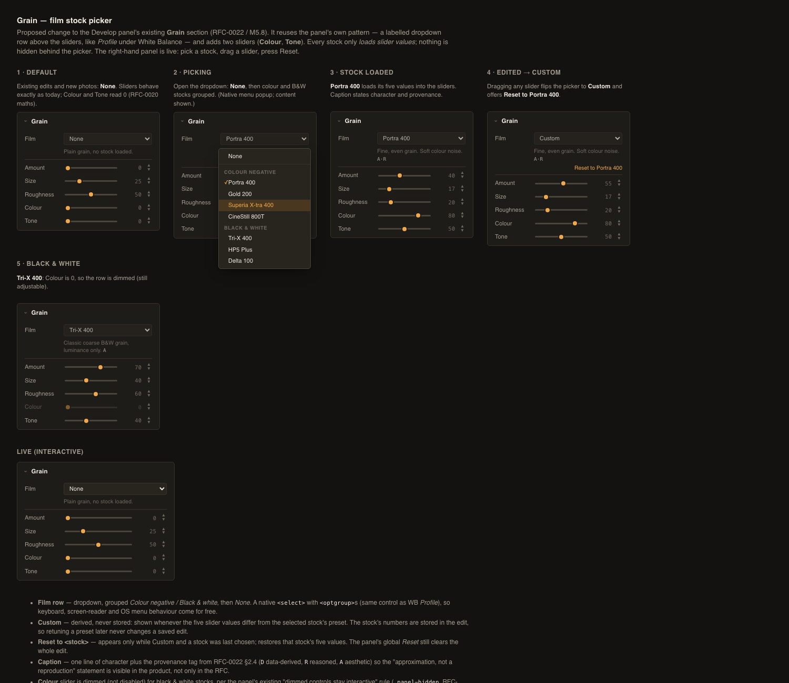

# RFC-0022: Negative film simulation for Grain — stocks, colour grain, tonal response, frame-relative size (M5.8)

- Status: Draft — for review in PR (flips to Accepted once merged)
- Date: 2026-10-01
- Companion documents: [PRD/MILESTONES §M5.8](../../PRD/MILESTONES.md#m58--negative-film-simulation-grain-stocks), [RFC-0020](RFC-0020-grain-particle-noise.md) (the generator this builds on), [develop_engine/effects.rs](../../app/src-tauri/src/develop_engine/effects.rs), [gpu/shaders/gradeUniforms.js](../../app/src/lib/gpu/shaders/gradeUniforms.js), [api/develop.js](../../app/src/lib/api/develop.js), [DevelopPanel.svelte](../../app/src/lib/components/DevelopPanel.svelte), [Appendix A](#appendix-a-how-the-findings-were-verified), [PROGRESS.md](../../PROGRESS.md)

## 0. Process note

User request (2026-09-30): add a "simulate negative film" milestone to Grain — pick a preferred negative stock and control its grain through sliders. [RFC-0020](RFC-0020-grain-particle-noise.md) deliberately built a stationary, CPU/GPU-identical, unit-variance noise function with a `seed` parameter as the substrate, and handed three items to this milestone: tone-dependent amplitude (and the black/white clipping that a uniform additive delta causes), per-channel (colour) grain, and resolution-relative grain size. The milestone also asks for a documented, honest per-stock parameter derivation. This RFC is the research and design pass for all of that; implementation is split into four slices (§7), each its own PR.

The headline research result is a limit: **published grain data can place only part of the stock list on a common scale** (§2). The RFC says so up front rather than presenting invented per-stock numbers as measured.

## 1. Problem

Grain today is a single stationary noise field with three sliders (Amount, Size, Roughness), added equally to R, G and B, with these gaps relative to real negative film:

1. **No notion of a stock.** There is nothing to pick; a user wanting "Tri-X-like" or "Portra-like" grain must guess slider values.
2. **Mono grain only.** The same delta goes to all three channels, i.e. luminance-only noise. Real colour negative grain is made of three independent dye layers, so it is chromatic; black-and-white grain is luminance-only.
3. **Uniform amplitude across tone.** Real grain is not equally visible everywhere (§3.3). The uniform additive delta is also one-sidedly clipped at 0/1, lifting pure blacks and darkening pure whites (RFC-0020 §2).
4. **Grain size is a fixed pixel scale.** `size` is a cell width in *pixels* (1–6 px), so the 2048-px interactive preview and a 6000-px export show grain at different sizes relative to the picture. This breaks the milestone's own exit criterion that preview and export agree. §3.4 shows it is also worse than "different size": point-sampling sub-pixel grain overstates its amplitude by up to 2× (measured).

## 2. Research: what published data exists, and what it can and cannot support

Everything below was re-extracted from the manufacturers' own data sheets (reproducible with [`datasheet_extract.py`](RFC-0022-appendix/datasheet_extract.py)); secondary sources (reviews, forum posts, retailer pages) were used only to find the primary documents and are **not** used as data.

### 2.1 What is published

| Stock | Published grain figure (primary source) | Scale |
|---|---|---|
| Kodak Portra 400 (135) | Print Grain Index **37 / 59 / 89** at 4×6 / 8×10 / 16×20 in (magnification 4.4× / 8.8× / 17.8×); 120 format: 25 / 37 / 59 at 2.6× / 4.4× / 8.8×; 4×5 in: <25 / <25 / 36 at 1.2× / 2× / 4× (Kodak E-4050, 2016) | PGI |
| Kodak Gold 200 (135) | Print Grain Index **44 / 64** at 4×6 / 8×10; 120 format 33 / 44 / 64 at 2.6× / 4.4× / 8.8× (Kodak E-7022, 2023) | PGI |
| Kodak Tri-X 400 | Diffuse rms granularity **17** ("fine"); Tri-X 320: 16 — read at net diffuse density 1.0, 48 µm aperture, 12× magnification, HC-110 dilution B (Kodak F-4017, 2021) | rms (σ_D × 1000) |
| Fujicolor Superia X-TRA 400 | Diffuse rms granularity **4**; 48 µm aperture, 12×, density 1.0 above minimum (Fujifilm product bulletin); resolving power 50 lines/mm at 1.6:1 contrast, 125 lines/mm at 1000:1 | rms |
| Kodak Vision3 500T (the base of CineStill 800T) | rms granularity **as a curve vs density, not a number**, "based on modified measuring techniques" (Kodak technical data) | rms curve |
| Ilford HP5 Plus, Delta 100 | **No numeric grain value** in Ilford's 64-page technical information (text search of the whole document for granularity / rms / grain index found only developer-recommendation text) | — |

### 2.2 What the data supports

1. **Graininess depends on magnification, not on the negative's pixel count.** In every Kodak table, PGI at a given magnification is identical across negative formats: Portra 400 at 4.4× is 37 on 135 *and* 37 on 120; at 8.8× it is 59 on both; Gold 200 at 4.4× is 44 on both and at 8.8× 64 on both. So grain is a *property of the film relative to the frame*, which is exactly the argument for frame-relative size (§3.4): the physical grain is a fixed fraction of the 36 mm frame no matter how many pixels the digital image has.
2. **Graininess grows steeply with magnification.** Portra 400: 37 → 59 → 89 over two octaves of magnification (+22 units, then +30). A viewer zooming in sees more grain; in the app this comes for free from pixel scale and needs no parameter.
3. **PGI is a perceptual, roughly logarithmic scale** (Kodak E-58: "intervals of perceived graininess correlate well with the logarithm of the visual granularity"; 25 is the visual threshold; **4 units = a difference 90% of observers can see; 2 units = 50%**). So the *spacing* between two PGI numbers at the same magnification is meaningful: Portra 400 (37) vs Gold 200 (44) at 4×6 prints = 7 units ≈ 1.75 four-unit (90%-JND) intervals, with Portra finer.
4. **Within one scale, ordering is real data**; across scales it is not (next).

### 2.3 What the data does not support

- **PGI and rms cannot be compared** — Kodak says so in every sheet ("a different scale which cannot be compared to rms granularity"). So Portra 400 / Gold 200 (PGI), Tri-X (Kodak rms) and Superia (Fuji rms) do not sit on one axis.
- **No constant converts PGI units into amplitude.** The E-58 explainer says the scale is logarithmic in "visual granularity" but gives neither the base nor the offset. The only quantitative step available is therefore an **assumption**: that a fixed PGI interval corresponds to a fixed amplitude ratio. The "JND" must be named: the explainer defines 2 units as a 50% JND (half of observers can tell) and 4 units as a 90% JND, and the Kodak sheets quote the 4-unit one. §2.4 uses **u = 1.25 per 4 PGI units** (the explainer's own example calls a 5→6, i.e. 20%, granularity change "more visually significant" than 10→11, which supports a ratio of that order but does not fix it) and states the sensitivity, rather than hiding the dependence. Per unit that is 1.25^(1/4) ≈ 1.057.
- **No grain-size or grain-structure figures** are published for any stock in the list (the rms aperture is a measurement parameter, not a grain size). T-Grain (Portra 400 — the sheet states "Micro-Structure Optimized KODAK T-GRAIN Emulsions") versus conventional crystals is a published *technology* difference with no number attached.
- **Vision3 500T** gives a curve (read off a graph, not text), and **Ilford** gives nothing numeric. Those stocks are aesthetic placements.
- A secondary-source claim seen while searching ("Portra 400 rms ≈ 8") contradicts the manufacturer's statement that rms was replaced by PGI for current stocks and was **not used**.

### 2.4 Per-stock derivation

Tags: **D** = derived from a published number, **R** = reasoned from a published *qualitative* statement or a physical argument (named), **A** = aesthetic choice (no data). Every row below is an *approximation of the character* of the stock, **not a reproduction of it**; no claim is made to match any manufacturer's proprietary look.

Amount is stated against a single anchor: **Portra 400 ≙ Amount 40** (aesthetic anchor: visible but fine). The only data-derived amplitude relationship in the whole list is Gold 200 relative to Portra 400: 7 PGI units = 1.75 four-unit intervals, and with u = 1.25 per interval the amplitude ratio is 1.25^1.75 ≈ **1.48**, so Gold 200 ≙ Amount 40 × 1.48 ≈ **59**. Sensitivity: u = 1.15 → 1.28 (Amount 51); u = 1.35 → 1.69 (Amount 68). The ordering (Gold grainier than Portra) is data; the spacing is assumption-dependent.

| Stock | Amount | Size (µm of a 36 mm frame) | Roughness | Colour | Tone | Basis |
|---|---|---|---|---|---|---|
| None | 0 | — | — | — | — | Today's plain grain (identity at Amount 0) |
| Kodak Portra 400 | 40 | 11 | 20 | 80 | 50 | Amount: **A** anchor. Roughness low: **R** (published T-Grain tabular crystals → more uniform grain). Size/Colour/Tone: **A**/**R**(§3) |
| Kodak Gold 200 | 59 | 13 | 40 | 80 | 50 | Amount: **D** (ratio 1.48 to Portra, assumption u = 1.25). Rest **A**. Note a 200-speed stock rated grainier than Portra 400 is what the PGI data says, against the speed-grain rule of thumb |
| Fujicolor Superia X-TRA 400 | 55 | 12 | 40 | 80 | 50 | **A** (rms 4 is on Fuji's scale; no cross-scale placement). Positioned with Gold 200 as a consumer 400-class stock |
| CineStill 800T (Vision3 500T base) | 62 | 16 | 55 | 80 | 50 | **A** (granularity published only as a curve; higher-speed motion-picture emulsion) |
| Kodak Tri-X 400 | 70 | 18 | 60 | 0 | 40 | Amount/Size: **A**. B&W so Colour 0: **D** (single-silver-layer B&W has no chromatic grain). rms 17 vs Superia's 4 (both "diffuse rms, 48 µm, density 1.0") supports B&W 400 being clearly grainier than colour 400, as placed; the 4× ratio is **not** used to set the numbers |
| Ilford HP5 Plus | 75 | 18 | 65 | 0 | 40 | **A** (no published figure) |
| Ilford Delta 100 | 30 | 9 | 25 | 0 | 40 | **A**; fine and uniform by the same T-Grain-class reasoning, a 100-speed stock |

Tone and Colour values are explained by the model in §3. The table is the *proposal for review*; the numbers are expected to be tuned by eye against the Kodak Grain Ruler style side-by-side on a test image (an exit criterion), with the tags kept in the shipped documentation so the provenance does not get lost when a number is tweaked.

## 3. Model

Extends RFC-0020's `grain_particle_noise(p, ρ, seed)` (unit variance, zero mean, `seed`-selectable). New stored parameters: `chroma` and `tone` (0–100), and the existing `size` changes unit (§3.4). Per pixel, with `Y` the pre-grain luma:

```
n_mono = noise(p, ρ, seed 0)                        // shared by all channels
n_c    = noise(p, ρ, seed s_c)   c ∈ {R, G, B}      // independent per channel
a = sqrt(1 − m),  b = sqrt(m),   m = chroma/100     // quadrature mixing: a² + b² = 1
delta_c = SIGMA · (amount/100) · w(Y) · r(cell_px) · ( a·n_mono + b·n_c )
```

### 3.1 Colour grain (`chroma`)

`a·n_mono + b·n_c` has **unit variance for every channel at every `m`** (a² + b² = 1, the noises independent), and the **cross-channel correlation is `a² = 1 − m`**. So `chroma = 0` is exactly RFC-0020's behaviour (identical delta to R, G, B) and `chroma = 100` is three independent fields; the slider only moves colour character, never strength — the same "knob changes character, not strength" principle RFC-0020 fixed for Roughness. Colour stocks use 80, not 100, because the visible luminance noise of a colour print is the weighted sum of three independent dye layers (reasoning **R**; not measured here).

Cost: `m = 0` is one noise evaluation per pixel (today's cost, ~60 ns/px CPU); `m > 0` is four. That is the milestone's own "3× the RFC-0020 cost" budget item and is handled in §6.

### 3.2 Seeds

`s_R, s_G, s_B` are fixed constants (distinct from 0 and from each other); like RFC-0020's seed they are not exposed. Golden vectors for each seed are asserted exactly like RFC-0020's.

### 3.3 Tonal response (`tone`)

`w(Y) = (1 − t) + t · 4·Y·(1 − Y)` with `t = tone/100`, `Y` the Rec.709 luma of the encoded pre-grain pixel clamped to [0, 1]. `w = 1` at mid-gray for every `t` (so Amount keeps its mid-tone meaning), and `t = 1` makes the grain vanish at pure black and pure white. **Physical reasoning (R, not data):** film grain is density noise; what the viewer sees is that noise passed through the print/scan tone curve, whose slope falls to zero in the toe and shoulder, so output amplitude falls toward both extremes. A dome-shaped weight is the simplest stand-in with a single parameter. A free side effect is that it closes RFC-0020's named "additive grain at pure black/white" clipping item: where `w → 0` the delta is not clipped, so blacks are not lifted. `tone = 0` is RFC-0020 exactly (`w ≡ 1`).

Not modelled, named: Selwyn-law density dependence of σ_D (grain increasing with density) and the asymmetric shadow behaviour of real negatives (under-exposure grainier than over-exposure) — a skewed `w` would capture them but needs data this RFC does not have.

### 3.4 Frame-relative size, and the sub-pixel amplitude problem (measured)

Make grain size a fraction of the **uncropped frame's long edge `L` (pixels)**, with the frame taken as a 36 mm full-frame width:

```
cell_um = 6 + (size/100) · 30                  // slider 0..100 → 6..36 µm
cell_px = cell_um · L / 36000
```

Calibration: at `L = 6000` (a 24 MP frame, 6 µm per pixel) `Size 25` gives 13.5 µm = **2.25 px**, which is exactly RFC-0020's default, so 24 MP images keep today's grain; other resolutions change, which is the point. (Grain is applied before crop in the pipeline, so cropping and straightening carry the grain with the picture, as a real negative would; this ordering is verified in slice 1, not assumed.)

**The part that is not obvious.** At the interactive preview cap (`DEVELOP_PREVIEW_MAX_DIMENSION = 2048`) one pixel is 17.6 µm, so a 13.5 µm grain is 0.77 px — *sub-pixel*. RFC-0020's generator point-samples the field, and a point sample of grain smaller than a pixel is **not** what the pixel would hold if it integrated the grain over its footprint (which is what a real exposure or a downsampled export does). Measured against 8×8 supersampled box-averaging of the continuous field ([`footprint_study.py`](RFC-0022-appendix/footprint_study.py), ρ = 0.5):

| Cell size (px) | Point-sampled std | Box-averaged std | Ratio | Closed-form `r(c)` |
|---|---|---|---|---|
| 0.25 | 1.00 | 0.275 | 0.274 | 0.286 |
| 0.5 | 1.01 | 0.491 | 0.486 | 0.513 |
| 0.75 | 1.01 | 0.662 | 0.653 | 0.667 |
| 1.0 | 1.00 | 0.767 | 0.766 | 0.767 |
| 1.5 | 1.03 | 0.906 | 0.877 | 0.873 |
| 2.25 | 1.03 | 0.971 | 0.940 | 0.937 |
| 3.5 | 0.99 | 0.958 | 0.973 | 0.973 |
| 6.0 | 0.99 | 0.983 | 0.991 | 0.990 |

So without correction the preview would show up to ~2× the grain amplitude of the export at a 0.5 px cell, and ~1.3× at 1 px — the exact "preview ≠ export" the milestone forbids. The correction `r(c) = c / sqrt(c² + 0.7)` fits the measured ratio to within 6% everywhere (3% for c ≥ 0.75). The rule it implements: **each pixel's std equals the std of the continuous field integrated over that pixel**, so a high-resolution render box-downsampled to the preview size has the same per-pixel amplitude as the preview. `SIGMA` is then the std of the *continuous* field (so the pixel std is `SIGMA · r(c)`); it is set so that a 24 MP frame at the default Size reproduces RFC-0020's measured 0.0511 at Amount 100 (≈ 0.0545, to be fixed to the measured value in slice 1).

**What `r(c)` does not fix, stated plainly:** it matches *amplitude*, not *spectrum*. At c = 1 the box-averaged field has adjacent-pixel correlation +0.31 against the point-sampled +0.12; at 0.5 px +0.10 against −0.02. A sub-pixel preview therefore looks slightly more "white" than the export's downsampled grain. Closing that gap exactly needs supersampling (4× the noise cost at c < 1) or an analytic pre-filtered kernel; neither is proposed here. The residual is measured in slice 1 and recorded; it is the honest limit of "preview = export" for sub-pixel grain.

## 4. Data model

The `grain` op gains `stock` (string, optional — the preset id last chosen, for display), `chroma` and `tone`. Absent `chroma`/`tone` read as 0, which reproduces RFC-0020's maths exactly (mono noise, uniform weight). The picker shows a stock only while the current five values equal that stock's preset values; otherwise it shows **Custom** — derived, not a stored flag, so editing a slider "flips" to Custom with no extra bookkeeping and a later preset retune cannot silently change a saved edit (the numbers are stored, not looked up). **None** sets Amount, Colour and Tone to 0 (plain grain, RFC-0020 behaviour) and leaves Size and Roughness, so a hand-tuned size is not lost. Rust (`Grain` struct, `grain_op`), JS (`getGrain`/`upsertGrain`/`buildGrainUniformData`) and the WGSL `Grain` struct each gain the two fields and the frame long edge `L` (a per-render uniform: the uncropped image's long edge in pixels, which the CPU path knows from the image and the GPU path from the source texture). Existing stored edits and the built-in presets (`presets.rs`) keep working unchanged; the only visible difference for them is the size unit (§5).

## 4a. UX

Mock: [grain-film-stock-mockup.html](../ux/mockups/grain-film-stock-mockup.html) (interactive; open in a browser) and its render below. It uses the app's real tokens and the Develop panel's existing row/select/slider markup, so it shows the proposed *delta* to the Grain section, not a redesign.



Decisions the mock fixes (and which review should confirm or change):

1. **A dropdown row, not a gallery.** A `Film` row above the sliders, a native `<select>` with `<optgroup>`s (*Colour negative* / *Black & white*) and *None* first — the same control and placement as White Balance › *Profile*. Native gives keyboard, screen-reader and OS menu behaviour for free and costs no panel height. Considered and rejected for v1: a thumbnail grid with grain swatches (would need per-stock rendered previews, a large panel footprint, and still can't show grain faithfully at thumbnail size).
2. **Every stock only loads slider values.** Nothing is hidden behind the picker; all five (Amount, Size, Roughness, Colour, Tone) stay sliders (milestone requirement).
3. **Custom is derived** (§4), shown the moment any value differs from the loaded stock; a **Reset to \<stock\>** link appears only in that state. The panel's global Reset still clears the whole edit.
4. **A one-line caption with the provenance tag** (D/R/A, §2.4) under the picker, so "approximation, not a reproduction" is visible in the product and not only in this RFC.
5. **Colour is dimmed, not disabled, for B&W stocks**, following the panel's existing "dimmed controls stay interactive" rule (RFC-0013).
6. **No new panel, no modal:** the section keeps its expand/hide-panel behaviour and its slot in the panel order.

Open for review: whether the caption should be one line (as drawn) or expand to show the §2.4 derivation on demand; whether the stock list should be user-hideable (deferred with user-authored presets).

## 5. A real, named consequence

Edits with non-default Size re-render at a different *pixel* grain size on any image that is not ~24 MP (a 12 MP image gets a larger pixel cell than before; a 45 MP image a smaller one), and the 2048-px preview now shows grain smaller than before, with the `r(c)` amplitude correction applied. No migration: there is no per-image resolution to compensate from in a stored edit, and the new behaviour is the one the milestone asks for. Everything else (`chroma = tone = 0`) is unchanged.

## 6. Testability and budget

- **Per-channel statistics**: unit variance and zero mean in each channel at `m` ∈ {0, 0.5, 1}; the measured cross-channel correlation equals `1 − m` within sampling error; `m = 0` bit-identical to RFC-0020's delta; `tone = 0` likewise.
- **Tonal weight**: exact `w` at hand-computed `Y` (0, 0.25, 0.5, 1 for t = 1 and t = 0.5); grain delta exactly 0 at `Y = 0` and `Y = 1` for `t = 1`; a pure-black and pure-white pixel stay exactly black/white (the RFC-0020 clipping item closed).
- **Frame-relative size / export = preview**, the milestone's own criterion, proven rather than assumed: render the same frame at two resolutions (e.g. 6000 and 2048 px long edge), box-downsample the large one to the small one's size, and compare per-pixel std (within a stated tolerance) and the spectrum shape (residual reported, §3.4); plus the `r(c)` closed form asserted against the supersampled ground truth in the Rust test suite for c ∈ {0.25 … 6}.
- **Golden vectors**: each seed's noise and the full per-channel delta at fixed inputs, from an independent numpy reference (extending RFC-0020's `grainlab.py`), asserted in Rust to 1e-4 and reproduced on a real GPU.
- **CPU/GPU parity (e2e)**: one colour-stock and one B&W-stock scenario in `develop-cpu-gpu-parity.e2e.js` (three points each, the RFC-0020 lesson: one pixel of noise is a weak witness), plus the real-GPU pixel comparison harness style RFC-0021 used (render the real shader module, compare with the CPU path).
- **Preset table**: a test that every stock's five values are within the sliders' ranges and that "None"/identity round-trips; the provenance tags (§2.4) live next to the constants in code.
- **Budget**: CPU grain cost is measured with `chroma > 0` (4 noise evaluations: ≈ 4 × 60 ns = 240 ns/px projected from RFC-0020's measurement, **not yet measured**); the interactive GPU path must stay within M5's ~100 ms budget with a colour stock at 2048 px, measured on a real GPU. If the CPU path is too slow the documented mitigations are, in order: the scanline particle cache RFC-0020 recorded (each cell's particles hashed once per row segment, not once per pixel); then K = 1 for the three chroma layers only, **after re-measuring** stationarity (RFC-0020 §3.2 never measured K = 1); never a silent quality downgrade.

## 7. Slicing (each its own PR, each with a "corrected during implementation" section)

1. **Frame-relative size + footprint compensation** — `L` uniform, `cell_px`, `r(c)`, `SIGMA` recalibration, the export = preview test. No new sliders. Touches Rust, WGSL, uniform packing.
2. **Tonal response** — `tone` slider and `w(Y)`; closes the black/white clipping item.
3. **Colour grain** — `chroma` slider, per-channel noise, the performance measurement and any mitigation it forces.
4. **Stock picker** — preset table with provenance tags, picker UI per §4a ("None" / stocks / "Custom"), persistence, copy-paste and history labels, colour + B&W parity scenarios, side-by-side tuning on a test image.

## 8. Non-goals

- **Colour/tone rendition, halation, bloom, print/paper simulation, push/pull processing, slide and cine stocks, user-authored presets** — the milestone's own deferred list stands.
- **A film-format (135 / 120 / 4×5) selector.** The PGI tables show format enters only through magnification, so a format control would be a pure scale on frame-relative size; deferred rather than designed here.
- **Matching any stock.** No claim of fidelity; §2.4 is a labelled approximation with its provenance.
- **Selwyn-law / asymmetric tonal skew** (§3.3), **per-image seeding**, and **spectral exactness of sub-pixel preview grain** (§3.4) are named limitations.

## 9. Exit criteria (this RFC; the milestone's own list also stands)

- RFC reviewed and merged; each slice (§7) lands with the §6 tests, real-GPU numbers recorded, and its own corrections section.
- At milestone close: every §2.4 number carries its tag in the shipped documentation; the export = preview comparison is recorded with measured numbers; the side-by-side of stocks on a fixed test image shows a visible difference in *character*, not only strength.

## Appendix A: how the findings were verified

### A.1 The published figures (§2)

[`datasheet_extract.py`](RFC-0022-appendix/datasheet_extract.py) downloads each manufacturer PDF listed in its `SOURCES` table, extracts the text with `pypdf`, and prints every line matching grain/PGI/rms/magnification patterns; the RFC's §2.1 table was read from that output (PDF text extraction loses table layout, so numbers were read off the printed lines and cross-checked against each other rather than parsed — e.g. the Portra 400 and Gold 200 PGI rows agree with each other across negative formats at equal magnification, which is a consistency check on the extraction).

What was checked and found:

- **Kodak E-4050 (Portra 400), E-7022 (Gold 200):** the PGI tables above, the "4 units = one JND for 90% of observers" and "25 = visual threshold" statements, the 14-inch standard viewing distance, and the sentence that PGI replaces rms and cannot be compared with it.
- **Kodak E-58 (the PGI explainer):** the perceptual-log-scale statement, the 2-unit = 50% JND / 4-unit = 90% wording, the "linear relationship between film granularity and print granularity for most colour negatives" statement, and the 48 µm ≈ 12× magnification definition of the rms aperture. It gives no formula converting PGI to amplitude (which is why §2.3 calls the unit-to-amplitude step an assumption).
- **Kodak F-4017 (Tri-X):** rms 17 (400) and 16 (320), conditions as in §2.1.
- **Fujifilm Superia X-TRA 400 bulletin:** rms 4 and the resolving-power figures.
- **Kodak Vision3 500T and Ilford technical information:** no numeric grain value (the first is a graph; the second has none), by text search.

### A.2 The sub-pixel amplitude finding (§3.4)

[`footprint_study.py`](RFC-0022-appendix/footprint_study.py) imports the RFC-0020 reference generator, evaluates the continuous field at 8×8 sub-pixel positions per pixel and averages (the "box-averaged" column) for cell sizes 0.25–6 px, compares its std and adjacent-pixel correlation with point sampling, and prints the closed-form `r(c)` next to the measurement.

### A.3 Limits of this verification (stated plainly)

- **Data sheets only, and a small set.** Seven stocks were considered; the numeric amplitude relationship between *any two* stocks rests on one pair (Portra 400 vs Gold 200) and one assumed JND ratio. Everything else is tagged **A** or **R** in §2.4 and the RFC claims nothing more.
- **PGI data are for prints of a given magnification viewed at 14 inches** with diffuse printing; mapping that to an on-screen image at arbitrary zoom is the app's pixel scale, not something the data validates.
- **No grain-size data exists** for these stocks in the sources used; sizes in §2.4 are aesthetic placements around the order of magnitude that the milestone's frame calibration implies (10–20 µm).
- **The footprint study uses one roughness (0.5)** and the RFC-0020 kernel; `r(c)` was fitted, not derived, and will be re-checked at ρ = 0 and 1 in slice 1's tests.
- **No visual evaluation yet.** Whether the proposed stock numbers *look* like their stocks is the tuning step in slice 4, not something this RFC establishes.
- **The CPU cost of colour grain is a projection** from RFC-0020's measured 60 ns/px, not a measurement.
